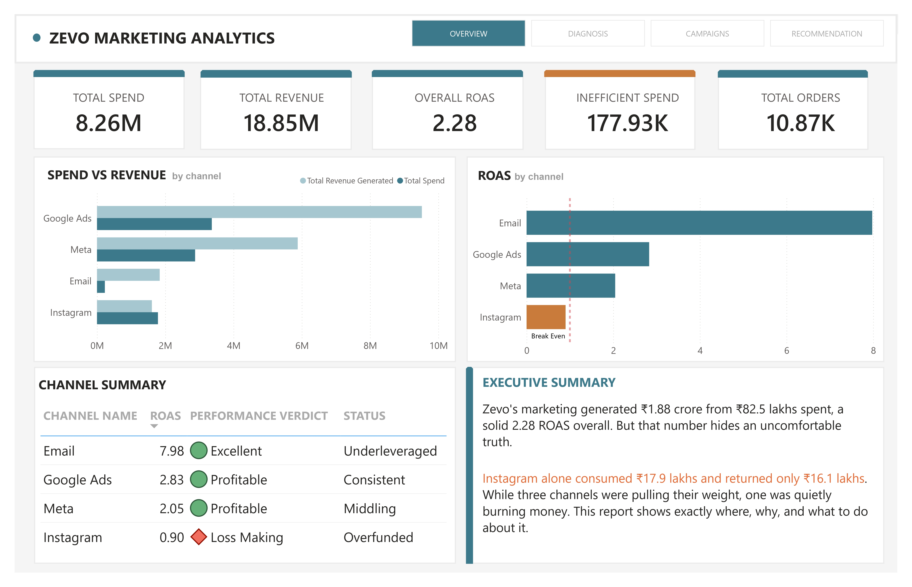
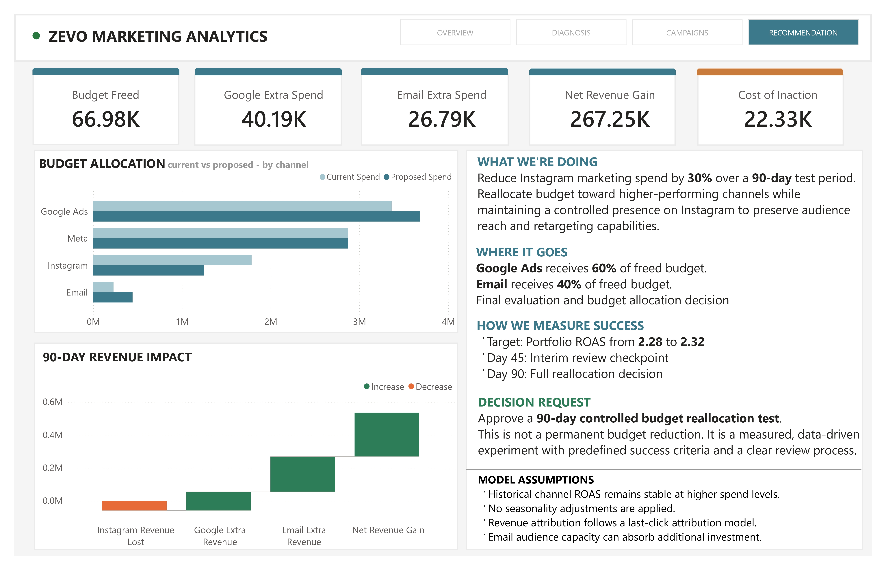
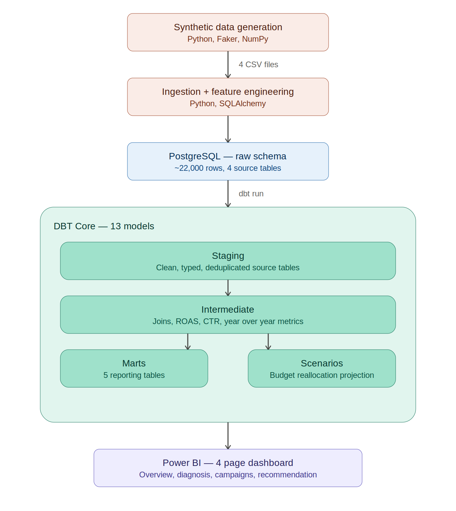

# 📊 Zevo Marketing Analytics | Business Case Study

## 🎯 Overview

Zevo, a fictional D2C skincare brand, spent ₹82.5L across four marketing channels over two years without a reliable way to measure channel profitability. I built an end to end marketing analytics pipeline that identified a loss making channel consuming ₹17.9L in spend and uncovered a projected ₹2.67L revenue recovery opportunity.

The project combines Python, PostgreSQL, DBT Core, SQL, and Power BI to move from raw marketing data to executive level recommendations.

---

## 📸 Dashboard Preview

### Executive Overview



### Strategic Recommendation



---

## 🚨 The Business Problem

Zevo runs paid campaigns across Google Ads, Meta, Instagram, and Email. Budget decisions were primarily driven by impressions and channel activity rather than revenue outcomes. There was no centralized system connecting marketing spend to business performance.

By the time this analysis was conducted, Instagram had been losing money for more than a year and the business had no visibility into the problem.

---

## 🔍 Key Findings

### 📈 Overall ROAS: 2.28

Healthy at the portfolio level, but masking a significant channel level issue.

### 📉 Instagram ROAS: 0.90

Instagram generated less revenue than it cost and deteriorated from 1.40 in 2023 to 0.53 in 2024.

### 📧 Email ROAS: 7.98

The highest performing channel despite receiving only 2.8% of total marketing budget.

### 🎯 Campaign Performance

* 22 of 136 campaigns were loss making
* All 22 belonged to Instagram

### ⚠️ Efficiency Decline

* Instagram CTR fell from 1.32% to 0.71%
* Cost per order increased from ₹800 to ₹1,853 while spend increased by 35%

---

## 💡 Strategic Recommendation

Conduct a 90 day controlled budget reallocation test:

* Reduce Instagram spend by 30%
* Redirect 60% of freed budget to Google Ads
* Redirect 40% of freed budget to Email

### 📌 Expected Outcome

* 💰 Projected Revenue Gain: ₹2.67L
* 💵 Additional Budget Required: ₹0
* 📅 Day 45: Interim review checkpoint
* 📅 Day 90: Final budget allocation decision

This recommendation is structured as a controlled experiment rather than a permanent budget reduction.

---

## 🏗️ Architecture



### Pipeline Summary

* ~22,000 rows across 4 source tables
* 13 DBT models
* Automated ingestion pipeline
* Scenario modeling layer for recommendations
* Executive dashboard for decision making

---

## 🛠️ Tech Stack

| Layer           | Tool                         |
| --------------- | ---------------------------- |
| Data Generation | Python, Faker, Pandas, NumPy |
| Data Storage    | PostgreSQL                   |
| Data Ingestion  | SQLAlchemy                   |
| Transformation  | DBT Core                     |
| Analysis        | SQL                          |
| Visualization   | Power BI                     |

---

## 📈 Dashboard

The dashboard is designed as a business narrative that moves from problem identification to strategic action.

### 📄 Page 1 | Executive Overview

* Portfolio level KPIs
* Spend vs Revenue by channel
* ROAS by channel
* Channel performance scorecard

### 📄 Page 2 | Diagnosis

* Instagram ROAS decline
* CTR deterioration
* Cost per order increase
* Spend vs Revenue comparison by year

### 📄 Page 3 | Campaign Analysis

* Top 10 campaigns by ROAS
* Bottom 10 campaigns by ROAS
* Campaign profitability map
* Campaign level performance metrics

### 📄 Page 4 | Strategic Recommendation

* Budget reallocation scenario
* Revenue impact waterfall
* Success measurement framework
* Decision request and assumptions

Additional dashboard screenshots are available in the `screenshots` folder.

---

## 🧪 Why Synthetic Data?

This project uses synthetic data by design rather than scraped or publicly available datasets. The goal was not to recreate a specific company, but to model realistic marketing behaviour and business challenges.

The dataset includes channel specific CTR and conversion benchmarks, audience fatigue effects, festival and weekend demand patterns, campaign growth curves, and varying profitability across acquisition channels. These relationships were intentionally modeled to create realistic analytical scenarios while maintaining consistency across the dataset.

Using synthetic data also allowed me to explore how businesses behave under different conditions and edge cases, including declining channel performance, inefficient budget allocation, and changing customer engagement patterns. This made it possible to build and test a complete analytics workflow from data generation and ingestion to transformation, reporting, and strategic recommendations.

Full generation logic is documented in the repository.

---

## 🚀 Skills Demonstrated

* Data Pipeline Design
* Python Automation
* PostgreSQL
* DBT Core
* SQL Analytics
* Scenario Modeling
* Marketing Analytics
* Business Intelligence
* Executive Reporting
* Data Storytelling

---

## 📂 Project Structure

```text
zevo-marketing-analytics/

├── README.md
├── architecture_diagram.png
├── requirements.txt
├── .gitignore

├── screenshots/
│   ├── page1_overview.jpg
│   ├── page2_diagnosis.jpg
│   ├── page3_campaigns.jpg
│   └── page4_recommendation.jpg

├── business_queries/

├── dashboard/
│   └── zevo_dashboard.pbix

├── pipeline/

└── zevo_analytics/
```

---

## ⚙️ How To Run

```bash
pip install -r requirements.txt

python pipeline/generate_data.py

python pipeline/ingest.py

cd zevo_analytics

dbt run
```

Open:

```text
dashboard/zevo_dashboard.pbix
```

and connect Power BI to your local PostgreSQL instance.

Set your own database credentials before running ingestion:

```bash
export DB_PASSWORD=yourpassword   # Mac/Linux
set DB_PASSWORD=yourpassword      # Windows cmd
```

---

## ⚠️ Limitations

### Attribution Model

This project uses last click attribution. Every order is credited to a single campaign. Assisted conversions and cross channel influence are not captured.

### Scenario Assumptions

The reallocation model assumes Google Ads and Email maintain historical efficiency as spend increases. Potential diminishing returns are not modeled.

### Seasonality

The recommendation is intentionally structured as a 90 day controlled test rather than a permanent change. This helps manage seasonality risk.

### Power BI Exception

One manually constructed comparison table exists within the Power BI layer for visualization purposes. The underlying values are sourced from the DBT scenario model.

---

## 🔮 Future Improvements

* Multi touch attribution modeling
* Additional budget reallocation scenarios
* Automated dashboard refresh
* Testing with real marketing data

---

### 🧰 Tech Stack

Python • PostgreSQL • DBT Core • SQL • Power BI

### 👤 Author

**Goutham Krishna**

